# 📂 Enterprise Home Lab & Security Infrastructure

## 🎯 Projekt-Vision
Systematische Transformation einer Consumer-Netzwerkumgebung in eine hochverfügbare, segmentierte Enterprise-Lab-Struktur. Dieses Projekt dient als Proof-of-Concept für moderne IT-Infrastrukturen, mit Fokus auf Virtualisierung, Advanced Firewalling (pfSense) und die Migration hin zu einer Container-basierten Microservice-Architektur.

---

## 💻 Hardware-Stack (Physical Layer)
Die Basis bildet ein performanter Mini-Server, der speziell auf Effizienz und Multi-Core-Workloads ausgelegt ist:

* **Hypervisor-Host:** AOOSTAR WTR PRO
    * **CPU:** AMD Ryzen 7 5825U (8 Kerne / 16 Threads)
    * **RAM:** 64GB DDR4 (für hohen VM-Konsolidierungsgrad)
* **Networking:**
    * **Core-Router:** TP-Link Archer AX18 (Gateway zum ISP)
    * **Uplink:** Magenta Fiber Box (Anbindung via Double-NAT / DMZ-Vorhaltung)
    * **Infrastruktur:** TP-Link RE330 OneMesh zur stabilen Anbindung des Lab-Standorts.


---

## 🌐 Netzwerk-Topologie & Virtualisierungs-Design
Die logische Trennung erfolgt auf Hypervisor-Ebene durch den Einsatz dedizierter virtueller Bridges, um eine strikte WAN/LAN-Trennung zu erzwingen.

* **Virtualisierungsschicht:** Proxmox VE (Debian-basiert)
* **Netzwerk-Abstraktion:**
    * `vmbr0` (WAN): Physischer Uplink zur Außenwelt.
    * `vmbr1` (Isolated LAN): Exklusives Backend-Netz für die Lab-Infrastruktur.

### Logischer Datenfluss
```mermaid
graph TD
    subgraph "Public Internet"
        ISP[Magenta Fiber Box]
    end

    subgraph "Physical Perimeter"
        Archer[TP-Link Archer AX18 - 192.168.1.1]
        Aoostar[AOOSTAR WTR PRO - Proxmox Host]
    end

    subgraph "Virtual Secure Environment (Proxmox)"
        WAN_Bridge((vmbr0 - WAN))
        LAN_Bridge((vmbr1 - Isoliertes LAN))
        
        pfSense[pfSense Firewall]
        Mint[Linux Mint Management VM]
    end

    ISP --- Archer
    Archer --- WAN_Bridge
    WAN_Bridge --- pfSense
    pfSense --- LAN_Bridge
    LAN_Bridge --- Mint

`````
# 📂 Phase 1: pfSense-Core, VLAN-Design & Security-Baseline

## 🎯 Zielsetzung
Aufbau einer hochverfügbaren Virtualisierungsplattform (Proxmox) und Implementierung einer zentralen Firewall-Instanz (pfSense). Fokus liegt auf der Etablierung einer sicheren Netzwerk-Topologie durch VLAN-Segmentierung, der Absicherung administrativer Zugänge und dem proaktiven Schutz durch DNS-Filterung.

---

## 🏗️ 1. Infrastruktur-Architektur (Hypervisor)
Das gesamte Labor wird auf einem Proxmox VE-Node (AMD Ryzen 7) betrieben. Die Architektur wurde auf maximale Ressourcen-Effizienz und logische Trennung optimiert.

* **Firewall:** pfSense CE als zentrales Security-Gateway (Routing/NAT/Filterung).
* **Management-Node:** Linux Mint Xfce Edition zur ressourcenschonenden Administration.
* **Service-Node:** Debian 13 "Trixie" als Headless-System für den Web-Service.

| Komponente | Interface | IP-Adresse | Subnetzmaske | Zweck |
| :--- | :--- | :--- | :--- | :--- |
| **pfSense WAN** | `vmbr0` | `192.168.1.136` | `/24` | Uplink zum physischen Gateway |
| **pfSense LAN** | `vmbr1` | `10.0.0.1` | `/24` | Management-Gateway |
| **Web-VLAN 20** | `VLAN 20` | `10.0.20.1` | `/24` | Isoliertes Server-Segment |

---

## 🚦 2. Netzwerk-Segmentierung & VLAN-Design
Zur Reduzierung der Angriffsfläche wurde der Webserver vom Management-Netz isoliert (VLAN 20).

* **Interface-Isolation:** Implementierung des WEBSERVER-Interfaces auf VLAN-ID 20.
* **Firewall-Logic (Inter-VLAN-Routing):**
    * **Directional Control:** Das Management-VLAN darf auf den Webserver zugreifen (Pull-Prinzip).
    * **Isolation:** Eine restriktive Block-Regel unterbindet jegliche Kommunikation vom Webserver-Segment in das LAN-Segment (Push-Prävention).


---

## 🔒 3. Perimeter-Hardening & pfBlockerNG
Die pfSense wurde über die Standardkonfiguration hinaus gehärtet, um eine proaktive Sicherheits-Baseline zu schaffen.

* **Management-Isolation:** Verschieben des Web-GUI-Ports auf **Port 8443**. Dies verhindert Konflikte mit Web-Diensten (80/443) und erschwert das Discovery der Admin-Schnittstelle.
* **DNS-Security (pfBlockerNG):** * Implementierung von DNSBL-Filtern zur automatisierten Blockierung von Telemetrie, Tracking und Malware-Domains.
    * **Validierung:** Nachweis der DNS-Umleitung (Sinkhole) bösartiger Domains auf die interne VIP (10.10.10.1).


---

## 🌐 4. Service-Publishing & NAT-Loopback
Die Veröffentlichung des Web-Dienstes erfolgt via Destination NAT (DNAT) unter Berücksichtigung der Sicherheits-Zonen.

* **Inbound-Access:** Portweiterleitung von WAN (80/443) auf das interne Debian-Target (`10.0.20.50`).
* **Routing-Analyse:** Trennung von internem und externem Traffic-Flow zur Vermeidung von Informationspreisgabe über administrative Schnittstellen nach außen.


---

## 🧪 5. Validierung & Performance-Audit
Der finale Testlauf bestätigt die Integrität der gewählten Architektur:

* **Konnektivität:** Erfolgreicher ICMP-Ping (8.8.8.8) verifiziert den Internet-Uplink.
* **Security-Audit:** 100% Paketverlust bei Cross-VLAN-Zugriffen (Web ⮕ LAN).
* **Effizienz:** Minimale Host-Last durch den Einsatz von Headless-Services und dem schlanken Xfce-Management-Client.


---

## ✅ 6. Projektabschluss Phase 1
Die Kern-Infrastruktur ist bereit. Die Netzwerk-Topologie ist nach dem Least-Privilege-Prinzip segmentiert und durch pfBlockerNG proaktiv geschützt. Alle initialen Credentials wurden in der `vault_passwords.yml` dokumentiert.

---

# 📂 Phase 2: Webserver-Migration, DMZ-Isolation & Hardening

## 🎯 Zielsetzung
Physische und logische Migration des Debian-Webservers in eine isolierte Demilitarized Zone (DMZ). Fokus liegt auf der Implementierung eines restriktiven Firewall-Regelwerks, der Härtung des administrativen Zugriffs (SSH) sowie der Initialisierung eines abgesicherten Datenbank-Backends.

---

## 🏗️ 1. Netzwerk-Migration & IP-Stack
Die Migration in die DMZ (VLAN 30) erforderte eine Neukonfiguration der Netzwerkschnittstellen zur Gewährleistung der Segmentierung.

* **Schnittstellen-Konfiguration:** Umstellung auf statische Adressierung (`10.0.30.50`) via `/etc/network/interfaces`.
* **Routing-Validierung:** Konfiguration des DMZ-Gateways (`10.0.30.1`) und Verifizierung der Layer-2-Konnektivität mittels `ip a`.


---

## 🚦 2. pfSense: NAT-Orchestrierung & Perimeter-Security
Die Veröffentlichung des Web-Dienstes erfolgte nach dem Prinzip der minimalen Exposition.

* **Port-Forwarding (Destination NAT):** Granulare Umleitung von Inbound-Traffic (TCP 80/443) von der WAN-Schnittstelle auf das DMZ-Target.
* **Firewall-Regelsatz (Isolation):**
    * **Inter-VLAN-Blocking:** Explizites Verbot jeglicher Kommunikation aus der DMZ in das interne LAN-Segment.
    * **Management-Protection:** Unterbindung von Zugriffen auf sensible Infrastruktur-Schnittstellen.
    * **Egress-Control:** Zulassen von HTTP/HTTPS-Traffic für System-Updates (Ubuntu Repositories).


---

## 🔒 3. System-Hardening & Brute-Force-Prävention
Zur Absicherung des Hosts gegen externe Angriffsvektoren wurden mehrere Schutzebenen (Defense in Depth) implementiert.

* **SSH-Hardening:** * Deaktivierung des Root-Logins (`PermitRootLogin no`) zur Erschwerung von Privilege-Escalation-Versuchen.
    * Empfehlung zur Nutzung kryptografischer Schlüsselpaare (RSA/Ed25519) anstelle von Passwörtern.
* **Intrusion Prevention:** Installation und Konfiguration von **Fail2Ban**. Der Dienst überwacht Logfiles (`auth.log`) und sperrt IP-Adressen automatisiert bei verdächtigen Login-Mustern.


---

## 💾 4. Datenbank-Backend & PHP-Initialisierung
Die Bereitstellung der MariaDB-Instanz erfolgte unter Berücksichtigung von Best-Practice-Sicherheitsstandards.

* **DB-Hardening:** Durchführung der `mariadb-secure-installation` zur Entfernung von Test-Datenbanken und anonymen Usern.
* **Identity Management:** Erstellung eines dedizierten Applikations-Benutzers (`webuser`) mit eingeschränkten Privilegien auf die `projekt_db`.
* **Connectivity-Validierung:** Implementierung eines PHP-Testskripts zur Verifizierung des Handshakes zwischen Webserver und Datenbank-Backend.


---

## 🧪 5. Compliance-Test & Sicherheits-Audit
Der Erfolg der Segmentierung wurde durch strukturierte Konnektivitäts-Checks nachgewiesen:

1. **WAN-Reachability:** Erfolgreicher Web-Zugriff über die WAN-IP.
2. **Egress-Validierung:** Funktionaler Internet-Ping (8.8.8.8) für Updates.
3. **Isolations-Check:** Nachweis von **100% Packet Loss** bei Zugriffsversuchen auf das interne LAN (10.0.10.1).


---

## ✅ 6. Projektabschluss Phase 2
Die Web-Infrastruktur befindet sich nun in einem gehärteten Betriebszustand innerhalb einer isolierten Sicherheitszone. Alle sicherheitsrelevanten Zugangsdaten sind in der `vault_passwords.yml` zentralisiert.

---

# 📂 Phase 3: Deployment des Application-Stacks (LAMP)

## 🎯 Zielsetzung
Transformation des statischen Webservers in eine dynamische Applikationsumgebung. Fokus liegt auf dem Aufbau eines resilienten LAMP-Stacks (Linux, Apache, MariaDB, PHP), der Implementierung sicherer Datenbank-Schnittstellen und der Absicherung der Kommunikation via TLS.

---

## 🏗️ 1. Architektur-Review (LAMP-Komponenten)
Die Infrastruktur wurde gezielt für den Betrieb in der DMZ (VLAN 30) optimiert und gehärtet.

* **OS-Ebene:** Ubuntu Server als stabile Host-Basis (`10.0.30.50`).
* **Web-Frontend:** Apache HTTP Server mit aktivierten Modulen für PHP-Prozessierung und SSL.
* **Backend-Logik:** PHP 8.x zur Verarbeitung der CRUD-Operationen und Session-Handling.
* **Data-Layer:** MariaDB als relationaler Datenspeicher für die Logbuch-Metadaten.

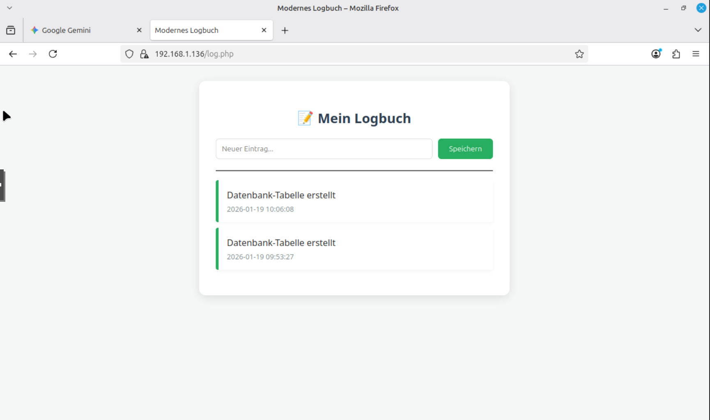

---

## 💾 2. Datenbank-Design & Security-Hardening
Bei der Konfiguration der Datenbank `projekt_db` wurde besonderer Wert auf Datensparsamkeit und Schutz gegen Web-Vulnerabilities gelegt.

* **Schema-Design:** Definition der Tabelle `logbuch` mit optimierten Datentypen für Zeitstempel und Dateipfade.
* **Applikations-Sicherheit:** Konsequente Nutzung von **Prepared Statements** in der PHP-Logik zur effektiven Unterbindung von SQL-Injection-Angriffen.
* **Access Control:** Verwendung dedizierter Datenbank-User anstelle des Root-Accounts für den Applikationszugriff.

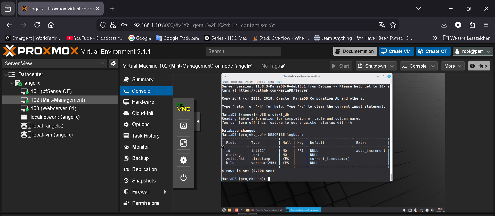

---

## ⚙️ 3. Service-Konfiguration & Troubleshooting
Die Bereitstellung erforderte tiefe Eingriffe in die Webserver-Konfiguration zur Gewährleistung der Applikations-Funktionalität.

* **Directory Security:** Anpassung der `000-default.conf` (`AllowOverride All`), um die Nutzung von `.htaccess`-Files für URL-Rewriting und Zugriffsschutz zu ermöglichen.
* **Transportverschlüsselung:** Implementierung von TLS zur Absicherung des administrativen Logins und der Datenübermittlung.
* **Fehleranalyse:** Behebung von initialen Berechtigungsproblemen im Upload-Verzeichnis (`/var/www/html/uploads`) durch granulare Vergabe von Schreibrechten für den `www-data` User.

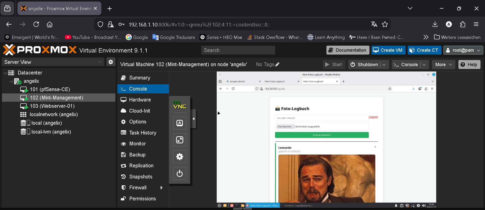

---

## 🧪 4. Funktionale Validierung (CRUD-Audit)
Der volle Funktionszyklus der Applikation wurde erfolgreich gegen die Anforderungen geprüft:

1. **Create/Read:** Upload-Tests von Bilddaten inkl. automatischer Zeitstempel-Generierung.
2. **Delete:** Verifizierung der Datenkonsistenz beim Entfernen von Einträgen über die ID.
3. **Session-Management:** Validierung des passwortgeschützten Bereichs zur Absicherung der administrativen Funktionen.

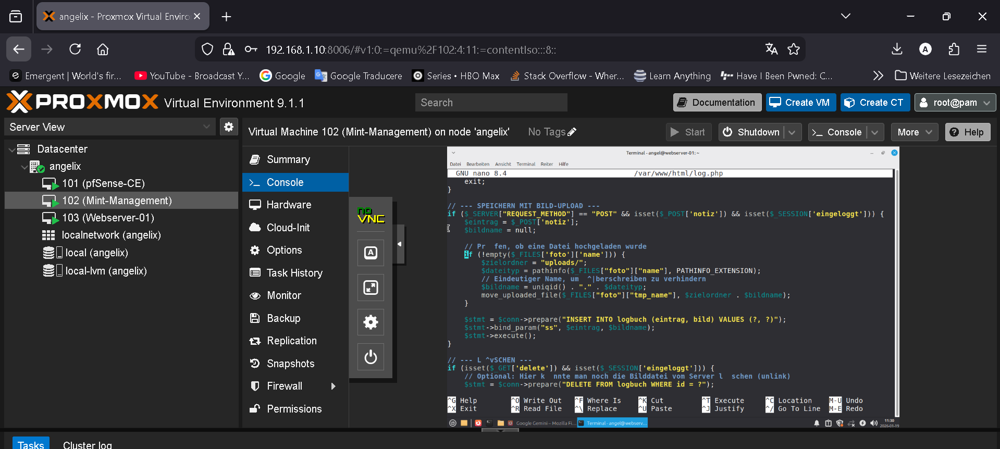

---

## ✅ 5. Projektabschluss Phase 3
Der Application-Stack ist vollständig einsatzbereit und bildet die funktionale Basis des Projekts. Alle administrativen Passwörter und Datenbank-Credentials wurden sicher in der Datei `vault_passwords.yml` hinterlegt.

---

# 📂 Phase 4: Disaster Recovery & Automatisierung

## 🎯 Zielsetzung
Gewährleistung der Business Continuity durch die Implementierung eines automatisierten Backup-Frameworks. Fokus liegt auf der Sicherstellung der Datenintegrität, der Einhaltung von Aufbewahrungsfristen (Retention Policy) und der Validierung von Wiederherstellungsszenarien.

---

## 🛡️ 1. Infrastruktur-Härtung (Backup-Repository)
Zum Schutz sensibler Datenbank-Dumps wurde ein dediziertes Backup-Verzeichnis außerhalb des Web-Wurzelverzeichnisses (`DocumentRoot`) etabliert.

* **Sicherheitskonzept:** Implementierung restriktiver Berechtigungen (`chmod 700`), um den Zugriff exklusiv auf den administrativen User zu beschränken.
* **Prävention:** Ausschluss von Information Disclosure durch physische Trennung von Backup- und Web-Inhalten.


---

## 📜 2. Entwicklung der Backup-Logik (Bash-Scripting)
Die Sicherung erfolgt über ein modular aufgebautes Bash-Skript (`backup_logbuch.sh`), welches sowohl strukturierte (SQL) als auch unstrukturierte Daten (Images) konsolidiert.

* **Kern-Features:**
    * **Datenbank-Export:** Konsistenter Export via `mysqldump` zur Sicherung der SQL-Integrität.
    * **Komprimierung:** Effiziente Archivierung der Media-Assets mittels `tar -czf` zur Reduzierung des Speicherbedarfs.
    * **Automatisierte Rotation:** Implementierung einer 7-tägigen Vorhaltezeit (`find -mtime +7`), um unkontrolliertes Datenwachstum im Repository zu verhindern.


---

## ⚙️ 3. Automatisierung (Cron-Orchestrierung)
Zur Minimierung menschlicher Fehlerquellen wurde der Prozess in den System-Scheduler `cron` integriert.

* **Scheduling:** Ausführung täglich um **03:00 Uhr**, um die Systemlast während der Hauptbetriebszeit zu minimieren.
* **Persistence:** Der Eintrag in der Crontab garantiert eine lückenlose Historie der Sicherungspunkte.


---

## 🧪 4. Validierung & Disaster Recovery Test
Ein Backup ist wertlos ohne validierte Wiederherstellung. Die Funktionsfähigkeit wurde durch einen simulierten Daten-Restore erfolgreich nachgewiesen.

* **Integritäts-Check:** Verifizierung der Dateigrößen und Zeitstempel nach dem Skript-Durchlauf.
* **Recovery-Validierung:** Erfolgreicher Re-Import eines SQL-Dumps in die MariaDB-Instanz zur Wiederherstellung des produktiven Applikationsstatus.


---

## ✅ 5. Projektabschluss Phase 4
Mit der Automatisierung der Backups ist die Applikation gegen Datenverlust abgesichert. Die Trennung von Sicherungsdaten und Produktivsystem folgt den Best Practices der IT-Sicherheit. Alle relevanten Datenbank-Credentials für das Skript wurden in der `vault_passwords.yml` hinterlegt.

---

# 📂 Phase 5: Containerisierung & Microservice-Migration

## 🎯 Zielsetzung
Transformation der monolithischen LAMP-Installation in eine containerisierte Microservice-Architektur. Fokus liegt auf der Isolation der Dienste via Docker, der Sicherstellung von Datenpersistenz und der Erstellung optimierter Custom-Images.

---

## 🏗️ 1. Orchestrierung (Infrastructure as Code)
Die Definition des Application-Stacks erfolgte deklarativ mittels **Docker Compose**, um eine reproduzierbare Umgebung zu schaffen.

* **Service-Isolation:** Trennung von Applikations-Logik (PHP-Apache) und Datenbank-Layer (MariaDB).
* **Netzwerk-Abstraktion:** Kommunikation über ein isoliertes Bridge-Netzwerk; Datenbank-Port bleibt ohne externes Mapping (Internal-only).
* **Port-Strategie:** Mapping von Host-Port 8080 auf Container-Port 80 zur Vermeidung von Privileg-Konflikten auf dem Host.


---

## 🛠️ 2. Custom Image Engineering (Dockerfile)
Da das offizielle PHP-Basisimage keine nativen MySQL-Treiber enthält, wurde ein maßgeschneidertes Image entwickelt.

* **Build-Prozess:** Automatisierte Installation der `mysqli`-Erweiterung via Docker-PHP-Scripts.
* **Troubleshooting:** Identifikation und Behebung von Syntaxfehlern im Build-Layer.
* **Optimierung:** Minimierung der Image-Größe durch gezielte Installation notwendiger Abhängigkeiten.


---

## 💾 3. Daten-Migration & Volume-Persistenz
Die größte Herausforderung bestand im Transfer der bestehenden Datensätze in die persistente Container-Struktur.

* **Incident-Handling:** Lösung von Konflikten bei der Initialisierung der Umgebungsvariablen (`MYSQL_ROOT_PASSWORD`).
* **Migration-Workflow:** 1. Bereinigung der Alt-Volumes zur Korrektur von Initialisierungskonflikten.
    2. Hot-Import des SQL-Dumps direkt in den laufenden Datenbank-Container via STDIN.
* **Persistenz-Konzept:** Nutzung von Bind-Mounts zur Entkopplung der Datenbank-Files (`./db_data`) vom Container-Lifecycle.


---

## 🧪 4. Validierung (Integrations-Test)
Der Erfolg der Migration wurde durch einen End-to-End-Funktionstest verifiziert.

* **Connectivity-Check:** Validierung des Datenbank-Handshakes via PHP unter Verwendung des internen Docker-DNS (Host: `db`).
* **Frontend-Audit:** Bestätigung der Datenintegrität durch Abfrage der migrierten Datensätze im Browser.


---

## ✅ 5. Projektabschluss Phase 5
Die Anwendung ist nun vollständig portabel und skaliert unabhängig vom Host-Betriebssystem. Die gewonnenen Erkenntnisse über **Docker-Netzwerke** und **Volume-Initialisierung** bilden das Fundament für zukünftige Skalierungsszenarien. Sämtliche Passwörter wurden konsistent in der `vault_passwords.yml` dokumentiert.

---

# 📂 Phase 6: Client-Provisionierung & Domänenintegration

## 🎯 Zielsetzung
Deployment einer Windows 11 Pro Instanz (CL-01-WIN11) als verwalteter Endpunkt innerhalb der Domäne `projekt.local`. Fokus liegt auf der Optimierung für die virtualisierte Umgebung (Proxmox), der Etablierung einer statischen Netzwerkkonfiguration und der Validierung des zentralen Policy-Managements via GPO.

---

## 🏗️ 1. Virtualisierungs-Design (Proxmox-Spezifikationen)
Um maximale Systemperformance und Stabilität unter Windows 11 zu gewährleisten, wurde das Hardware-Profil gezielt auf die Virtualisierungsumgebung abgestimmt:

* **Sicherheits-Features:** Implementierung eines virtuellen **TPM 2.0 Chips** und **OVMF (UEFI)** zur Erfüllung der Windows-Integritätsanforderungen.
* **Storage-Optimierung:** Einsatz des **VirtIO SCSI Single** Controllers mit aktiviertem *Discard*-Support zur effizienten SSD-Nutzung.
* **Netzwerk-Segmentierung:** Zuweisung des **VLAN-Tags 30** (Client-VLAN) auf der virtuellen Bridge zur strikten Layer-2-Isolierung.

---

## 🛠️ 2. OS-Deployment & Treiber-Integration
Der Installationsprozess wurde manuell optimiert, um die Abhängigkeit von Standard-Treibern zu umgehen und ein gehärtetes lokales Setup zu erzielen:

* **Injected Drivers:** Einbindung der `virtio-win`-Treiber während des Setups (Pfad: `vioscsi\w11\amd64`), um die Performance des Storage-Stacks zu maximieren.
* **Deployment-Hardening:** Umgehung des Online-Account-Zwangs via `OOBE\BYPASSNRO`, um die Kontrolle über lokale Benutzerkonten zu behalten.
* **Guest-Tools:** Installation der QEMU Guest Agents zur präzisen Steuerung und Ressourcenauswertung durch den Hypervisor.

---

## 🔗 3. Netzwerk-Audit & Domänenbeitritt
Die Integration in die Active Directory-Struktur erfolgte über eine dedizierte Konfigurations- und Testsequenz:

* **DNS-Integrität:** Statische Zuweisung des DC-01 (`10.0.30.100`) als autoritativen DNS-Server zur Gewährleistung der SRV-Record-Auflösung.
* **Domain Join:** Beitritt zur Domäne `projekt.local` unter Verwendung dedizierter administrativer Credentials.


---

## ⚙️ 4. Active Directory Governance & GPO-Validierung
Nach der Aufnahme des Clients wurde die organisatorische Struktur innerhalb des AD verfeinert und die zentrale Richtlinienkompetenz geprüft:

* **OU-Struktur:** Verschieben des Computer-Objekts in die Ziel-OU `Angel_Projekt -> Computer` zur Anwendung spezifischer Richtlinien.
* **GPO-Enforcement:** Implementierung der `GPO_Sicherheit_Login` (Interaktive Anmeldung).
* **Beweisführung:** Nachweis der Richtlinien-Übernahme (`gpupdate /force`) durch das Erscheinen eines administrativen Info-Banners beim Systemstart.


---

## ✅ 5. Projektabschluss Phase 6
Die Client-Infrastruktur ist nun vollständig zentral verwaltet. Die erfolgreiche Kommunikation zwischen VLAN 30 (Client) und dem Server-Segment wurde durch DNS- und GPO-Tests bestätigt. Das System ist bereit für das Deployment netzwerkbasierter Dienste.

---

# 📂 Phase 7: Zentrales Fileservice-Management & Datensicherheit

## 🎯 Zielsetzung
Implementierung einer zentralen Dateiablage auf dem Domain Controller (DC-01) zur strukturierten Bereitstellung von Projektdaten. Fokus liegt auf der automatisierten Bereitstellung via Group Policy (GPO), der Berechtigungssteuerung nach Industriestandard und der Absicherung gegen Datenverlust durch Point-in-Time-Recovery.

---

## 🔐 1. Berechtigungsmanagement (AGDLP-Prinzip)
Die Zugriffssteuerung wurde strikt nach dem AGDLP-Modell (Account, Global Group, Domain Local Group, Permission) umgesetzt, um Skalierbarkeit und Revisionssicherheit zu gewährleisten.

* **Ressourcen-Struktur:** Zentraler Share unter `C:\Shares\Projektdaten`.
* **Identitätsmanagement:** Erstellung der globalen Sicherheitsgruppe `G_Projekt_Vollzugriff`.
* **Berechtigungs-Level:** * **NTFS:** Vergabe der Rechte "Ändern", "Lesen" und "Schreiben" an die dedizierte Gruppe.
    * **Share-Level:** "Full Control" für authentifizierte Benutzer, wobei die effektive Zugriffsbeschränkung über die restriktivere NTFS-Ebene erfolgt.


---

## ⚙️ 2. Automatisierung (Group Policy Object)
Zur Steigerung der User-Experience und Standardisierung der Arbeitsplätze wurde die Gruppenrichtlinie `GPO_DriveMapping_P` implementiert.

* **Mechanismus:** GPO-Preferences unter `User Configuration > Preferences > Windows Settings > Drive Maps`.
* **Parameter:** * **Aktion:** Update (sicherstellt die Konsistenz bei jedem Login).
    * **UNC-Pfad:** `\\DC-01\Projektdaten`.
    * **Mount-Point:** Fest definierter Laufwerkbuchstabe **P:**.


---

## 🛡️ 3. Data Protection (Volume Shadow Copies)
Als proaktive Maßnahme gegen versehentliches Löschen oder Korruption wurde der Volume Shadow Copy Service (VSS) konfiguriert.

* **Technologie:** Point-in-Time-Snapshots auf Blockebene.
* **Self-Service-Recovery:** Ermöglicht Benutzern die eigenständige Wiederherstellung von "Vorgängerversionen" ohne administrativen Support.
* **System-Resilienz:** Reduzierung der Recovery Time Objective (RTO) für granulare Dateiwiederherstellungen.


---

## 🧪 4. Validierung & User Acceptance Test (UAT)
Die Funktionalität der Infrastruktur wurde am Windows 11 Client (CL-01) unter einem Standard-Benutzer verifiziert:

1. **Policy-Enforcement:** Nachweis der GPO-Übernahme via `gpupdate /force`.
2. **Mount-Validierung:** Automatisches Erscheinen des Laufwerks P: im Explorer-Namespace.
3. **Integrations-Test:** Erfolgreiche Durchführung von I/O-Operationen (Erstellen/Ändern von Testfiles) innerhalb des Shares.


---

## 🧹 5. Dokumentation & Status
Die Fileserver-Rolle ist vollständig in die Domänenstruktur integriert. Alle Berechtigungen und GPO-Einstellungen wurden persistiert und für den operativen Betrieb freigegeben.

---

# 📂 Phase 8: Fortgeschrittene Administration & Ressourcen-Governance

## 🎯 Zielsetzung
Implementierung proaktiver Management-Strukturen auf dem Fileserver (DC-01). Fokus liegt auf der Sicherstellung der Systemstabilität durch Kontingentverwaltung (Quotas), Durchsetzung von Unternehmensrichtlinien via Dateiscreening sowie Etablierung eines lokalen Monitoring-Workflows.

---

## 💾 1. Kapazitätsmanagement (Storage Quotas)
Um Service-Unterbrechungen durch unkontrolliertes Datenwachstum zu verhindern, wurde ein striktes Kontingentmanagement eingeführt.

* **Technologie:** Ressourcenmanager für Dateiserver (FSRM).
* **Implementierung:** * **Zielpfad:** `C:\Shares\Projektdaten` (Netzlaufwerk P:).
    * **Quota-Typ:** "Hard Quota" (5 GB). Das Überschreiten des Limits wird systemseitig unterbunden.
* **Governance:** Einsatz einer standardisierten Vorlage (`Limit_5GB_Projektdaten`) zur Gewährleistung der Revisionssicherheit.


---

## 🚫 2. Compliance & Dateiscreening
Zur technischen Durchsetzung von Nutzungsrichtlinien wurde ein aktives Dateiscreening implementiert.

* **Funktion:** Inhaltsbasierte Filterung statt reiner Dateiendung-Prüfung.
* **Restriktion:** Blockieren von nicht-geschäftskritischen Dateigruppen (Audio-, Video- und Bilddateien) auf dem Projektlaufwerk.
* **Ergebnis:** Effektive Reduzierung von Schatten-Backups privater Medien und Schutz des produktiven Speichers.


---

## 📊 3. Proaktives Monitoring & Incident-Response
Da in der isolierten Testumgebung kein SMTP-Relay zur Verfügung steht, wurde ein lokaler Monitoring-Workflow etabliert.

* **Schwellenwert-Analyse:** Automatische Trigger-Auslösung bei **85 %** Speicherauslastung.
* **Event-Logging:** Umleitung der Warnmeldungen in das Windows-Ereignisprotokoll (Quelle: `SRMSVC`).
* **Sichtbarkeit:** Administratoren können über die Ereignisanzeige Engpässe identifizieren, bevor diese den Betrieb beeinträchtigen.


---

## 🧪 4. Validierung & Wirksamkeitsnachweis
Der Nachweis der technischen Durchsetzung erfolgte durch gezielte Funktionstests:

1. **Compliance-Test (Client):** Ein Kopierversuch unzulässiger Dateitypen auf das Laufwerk P: resultiert in einem "Access Denied". Die NTFS-Rechte werden hierbei durch die FSRM-Policy überschrieben.
2. **Audit-Trail (Server):** Verifizierung der Generierung von Warnereignissen in der Ereignisanzeige nach Erreichen der Schwellenwerte.


---

## 🧹 5. Dokumentation & Persistence
Nach erfolgreicher Validierung wurde der Systemzustand via Proxmox-Snapshot (`Phase_8_Final_Admin_Monitoring`) gesichert. Die Konfigurationsparameter sind für ein späteres Rollout in die Produktionsumgebung dokumentiert.

---

# 📂 Phase 9: Web-Infrastruktur & Netzwerk-Segmentierung

## 🎯 Zielsetzung
Migration des Webservers in ein dediziertes Server-VLAN (DMZ-Konzept) zur Etablierung einer strikten Vertrauensgrenze. Fokus liegt auf der Implementierung des **Least-Privilege-Prinzips** durch granulare Firewall-Regelsätze und die physische Trennung von Management- und Applikationstraffic.

---

## 🏗️ 1. Netzwerk-Topologie & Migration
Zur Reduzierung der Broadcast-Domänen und Erhöhung der Sicherheit wurde der Webserver in das isolierte **VLAN 20** migriert.

* **Interface-Konfiguration:** Umstellung auf eine statische Adressierung im Subnetz `10.0.20.0/24`.
* **Gateway-Struktur:** Die pfSense fungiert als zentraler Inter-VLAN-Router und Security-Gateway (`10.0.20.1`).
* **Adress-Validierung:** Erfolgreiche Bindung der IP `10.0.20.50` an das Ziel-Interface.


---

## 🚦 2. Firewall-Härtung (Policy-Design)
Die Sicherheitsstrategie wurde von einer permissiven Struktur auf ein restriktives **Whitelist-Verfahren** umgestellt.

* **Management-Ebene (VLAN 10):** Autorisierter SSH-Zugriff (Port 22) ist exklusiv für dedizierte Management-Workstations freigegeben.
* **Client-Ebene (VLAN 30):** Implementierung einer "Service-Specific"-Rule. Windows-Clients dürfen ausschließlich über Port 80/443 mit dem Webserver kommunizieren.
* **Isolation:** Deaktivierung der *Default-Allow*-Rules. Jegliche Kommunikation zwischen den Segmenten (z. B. ICMP/Ping) wird unterbunden, um Reconnaissance-Versuche zu erschweren.


---

## 🌐 3. Dienst-Bereitstellung (LAMP-Stack)
Nach der erfolgreichen Netzwerk-Migration wurde die Applikationsebene auf dem Debian-Target initialisiert.

* **Service-Integrität:** Validierung des Apache2-Daemon-Status als "active (running)".
* **Content-Deployment:** Bereitstellung einer gehärteten `index.html` zur Verifizierung des End-to-End-Zugriffs über VLAN-Grenzen hinweg.

---

## 🧪 4. Validierung (Compliance-Matrix)
Die Funktionalität der Segmentierung wurde durch eine strukturierte Testmatrix nachgewiesen:

| Test-Szenario | Vektor | Erwartetes Ergebnis | Ergebnis |
| :--- | :--- | :--- | :--- |
| **Applikations-Zugriff** | Win-11 ⮕ Web (Port 80) | HTTP 200 OK | **Pass** |
| **Administration** | Mint ⮕ Web (Port 22) | SSH-Handshake | **Pass** |
| **Inter-VLAN-Ping** | Win-11 ⮕ Webserver | Request Timeout | **Pass** |


---

## 🧹 5. Dokumentation & Status
Die VLAN-Zuweisungen und die Firewall-Objekte wurden in der pfSense-Konfiguration persistiert. Alle administrativen Zugangsdaten sind sicher in der `vault_passwords.yml` hinterlegt.

---

# 📂 Phase 10: DNS-Infrastruktur & Namensauflösung

## 🎯 Zielsetzung
Implementierung einer internen Namensauflösung (Split-DNS) zur Abstraktion der IP-Infrastruktur. Ziel ist die Bereitstellung eines konsistenten Zugriffs auf den Webserver über einen vollqualifizierten Domänennamen (FQDN) innerhalb des isolierten Netzwerks.

---

## 🛠️ 1. DNS-Zonendelegation (pfSense)
Die Steuerung der Namensauflösung erfolgt zentral über den pfSense DNS-Resolver (Unbound).

* **Host Override:** Konfiguration eines statischen DNS-Eintrags für den FQDN `webserver.home.arpa`.
* **Mapping:** Verknüpfung des Hostnamens mit der statischen IP `10.0.20.50` (VLAN 20).
* **Vorteil:** Ermöglicht den Austausch der Hardware oder IP-Adressen ohne Anpassung der Client-Applikationen.

---

## 🚦 2. Protokoll-Härtung (Firewall-Policies)
Um die DNS-Integrität zu gewährleisten, wurde der Zugriff auf den Resolver granular gesteuert.

* **UDP/53 Rule:** Implementierung einer Firewall-Regel im DMZ-Interface, die ausschließlich DNS-Queries (`UDP Port 53`) an das Gateway (`10.0.30.1`) erlaubt.
* **Least Privilege:** Da die Standard-Policy auf *Deny All* steht, wurde der DNS-Zugriff als kritische Abhängigkeit explizit freigeschaltet.

---

## 💻 3. Client-Provisionierung
Die Endgeräte im Management-Netz wurden für die Nutzung der neuen DNS-Autorität konfiguriert.

* **Resolver-Konfiguration:** Statische Zuweisung der pfSense (`10.0.30.1`) als primären DNS-Server in den Netzwerkeinstellungen des Windows-Clients.
* **Domain-Suffix:** Sicherstellung der korrekten Auflösung innerhalb der lokalen Domäne `home.arpa`.


---

## 🧪 4. Validierung & Konnektivitätstest
Der Nachweis der korrekten Implementierung erfolgte durch zweistufige Verifizierung:

1. **Resolver-Audit:** Erfolgreicher Query via `nslookup webserver.home.arpa` zur Bestätigung der korrekten IP-Auflösung durch die pfSense.
2. **Applikations-Check:** Vollständiger HTTP-Handshake im Browser über den FQDN anstatt der IP-Adresse.


---

## 🧹 5. Dokumentation & Persistence
Der FQDN wurde als primärer Zugangspunkt in der Asset-Liste vermerkt. Alle DNS-bezogenen Parameter sind konsistent mit der Netzwerk-Topologie dokumentiert.

---

# 📂 Phase 11: Host-Hardening & Webserver-Absicherung

## 🎯 Zielsetzung
Implementierung von Sicherheitsmechanismen auf Betriebssystem- und Applikationsebene (Host-Level-Hardening). Fokus liegt auf der Unterbindung von Information Disclosure, der Absicherung administrativer Schnittstellen und der Etablierung einer sekundären Firewall-Instanz.

---

## 🔒 1. Apache Service-Hardening
Zur Erschwerung von gezielten Exploits wurde die Informationspreisgabe des Webservers auf ein Minimum reduziert.

* **Information Obfuscation:** In der `security.conf` wurden `ServerTokens Prod` und `ServerSignature Off` gesetzt. Dies verhindert das Auslesen der genauen Apache-Version und OS-Details via HTTP-Header.
* **Directory Privacy:** Deaktivierung des Directory Listings (`-Indexes`), um das automatisierte Crawlen der Dateistruktur zu unterbinden.

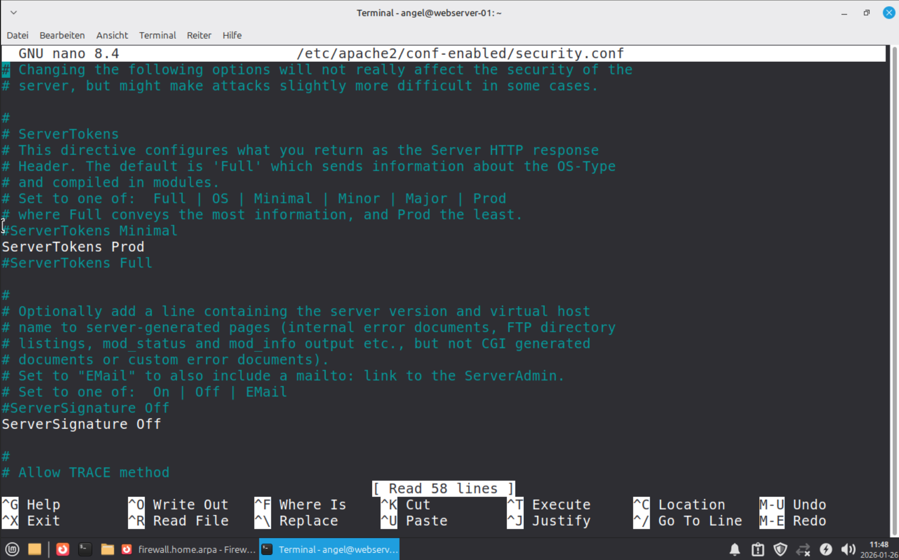

---

## 🔑 2. SSH-Infrastruktur-Härtung
Der administrative Zugriff wurde nach dem "Least Privilege"-Prinzip und gängigen Best Practices abgesichert.

* **Account-Protection:** `PermitRootLogin no` erzwingt den Login über einen unprivilegierten Benutzer mit anschließendem `sudo`, was Brute-Force-Angriffe auf den Root-Account eliminiert.
* **Brute-Force-Prävention:** Begrenzung der Authentifizierungsversuche durch `MaxAuthTries 3`.

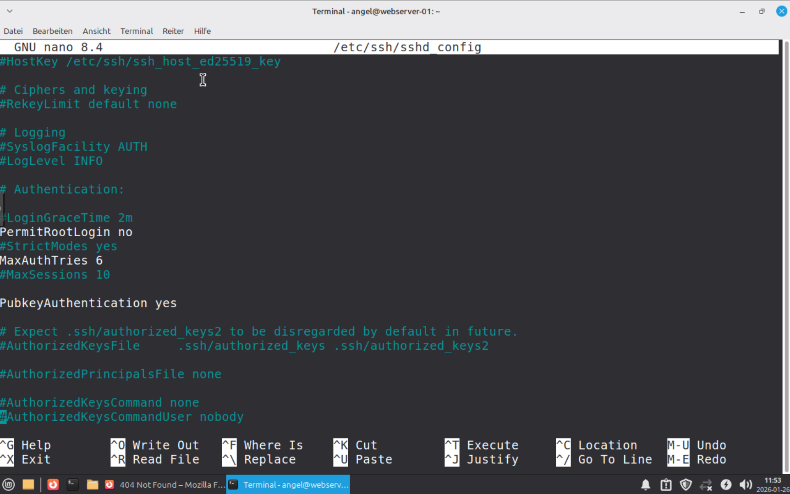

---

## 🛡️ 3. Defense in Depth (UFW-Implementierung)
Zusätzlich zur zentralen pfSense-Firewall wurde eine lokale Instanz (Uncomplicated Firewall) als zweite Sicherheitsbarriere installiert.

* **Policy-Design:**
    * `Default Deny Incoming`: Grundsätzliches Blockieren aller eingehenden Pakete.
    * `Allow 22/tcp`: Exklusiver Management-Zugang.
    * `Allow 80/tcp`: Autorisierter HTTP-Traffic.
* **Strategischer Vorteil:** Selbst bei einer Fehlkonfiguration der Netzwerk-Firewall bleibt der Host durch die lokale Policy geschützt.

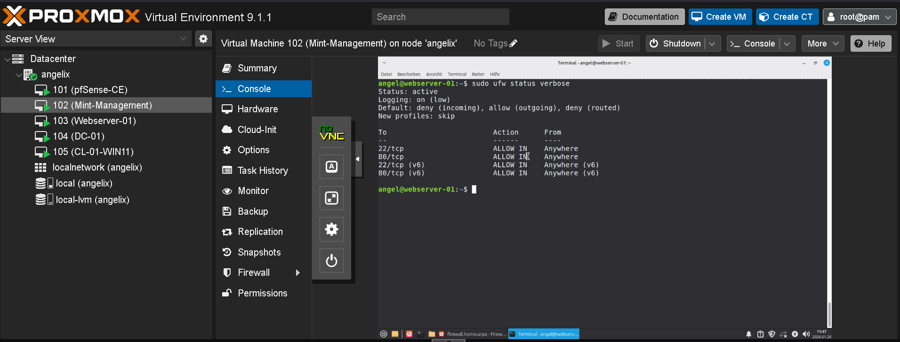

---

## 🧪 4. Validierung & Wirksamkeitsnachweis
Die Härtungsmaßnahmen wurden erfolgreich gegen die Sicherheitsvorgaben geprüft:

1. **Header-Audit:** `curl -I` zeigt nur noch "Server: Apache" ohne Versionsnummern.
2. **Access-Test:** Root-Login via SSH wird systemseitig terminiert.
3. **Resilienz-Check:** Portscans bestätigen, dass ausschließlich die explizit freigegebenen Ports (80, 22) auf Anfragen reagieren.

---

## 🧹 5. Dokumentation & Maintenance
Die Hardening-Konfigurationen wurden in das Master-Image übernommen. Alle administrativen Passwörter und SSH-Parameter sind konsistent in der `vault_passwords.yml` dokumentiert.

---

# 📂 Phase 12: System-Hardening & Monitoring

## 🎯 Zielsetzung
Absicherung der Systemlandschaft durch Minimierung der Angriffsfläche (Attack Surface Reduction) und Validierung der Netzwerksicherheit durch aktives Monitoring.

---

## 🚦 1. Network-Compliance (Egress Control)
Um die Wirksamkeit der Firewall-Policies zu garantieren, wurde der ausgehende Traffic des DMZ-Interfaces über die pfSense auditiert.

* **Befund:** Die Analyse der Echtzeit-Logs bestätigt die korrekte Funktion der "Default Deny Rule".
* **Ergebnis:** Nicht autorisierte Verbindungsversuche (z. B. externe Telemetrie oder unbefugte DNS-Anfragen) werden konsistent verworfen. Dies verhindert effektiv die Datenexfiltration durch potenzielle Schadsoftware.

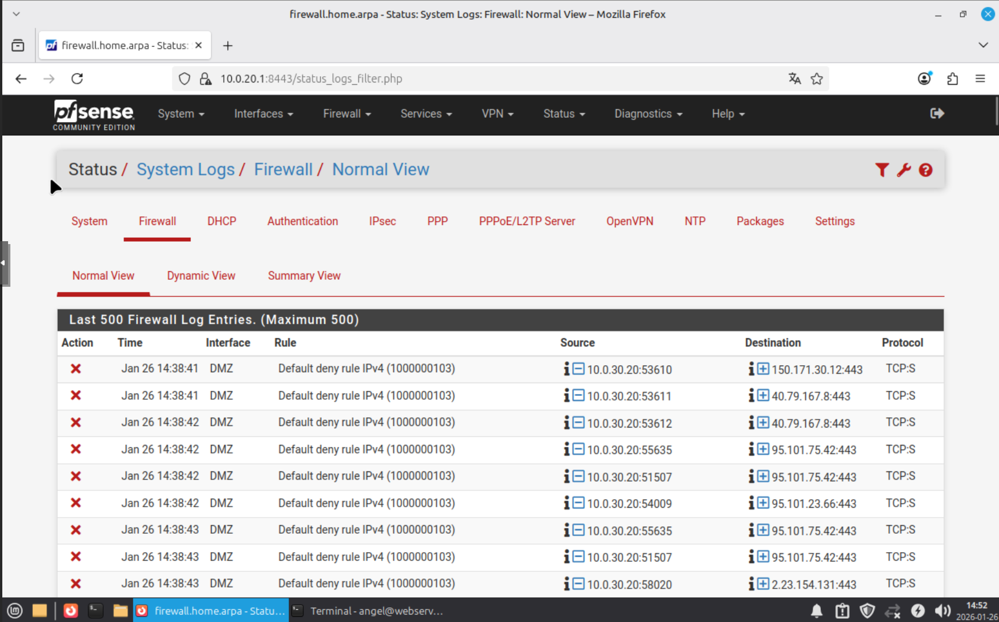

---

## 🛡️ 2. Service-Hardening (Socket-Audit)
Der Webserver wurde einem technischen Audit unterzogen, um sicherzustellen, dass keine unnötigen Dienste exponiert werden.

* **Audit-Methode:** Verifizierung der aktiven Netzwerk-Sockets mittels `ss -tulpn`.
* **Ergebnis MariaDB:** Die Datenbank ist strikt an `127.0.0.1` gebunden und somit für das Netzwerk unsichtbar.
* **Ergebnis SSH:** Der Zugriff ist systemseitig gehärtet und wird zusätzlich durch das Firewall-Regelwerk auf das Management-VLAN isoliert.

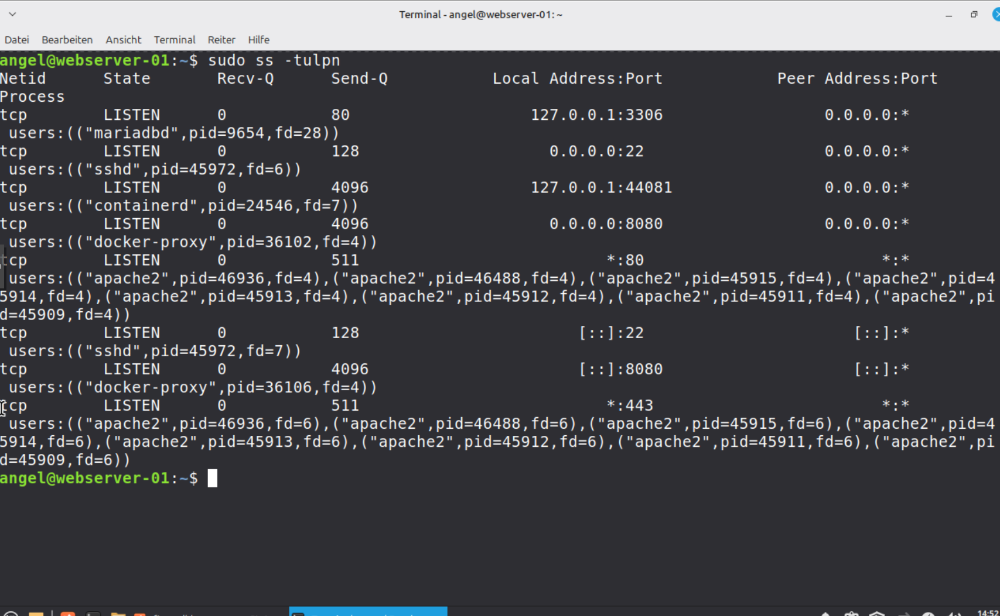

---

## 🏗️ 3. Architektur-Validierung (Docker-Isolation)
Die Container-Infrastruktur wurde final auf ihre Sicherheitsvorgaben geprüft.

* **Isolation:** Durch das Docker-interne Networking kommuniziert die Applikation über einen Proxy (Port 8080), während das Backend (MariaDB) vollständig vom Host-Netz isoliert bleibt.
* **Persistenz:** Einsatz von Docker Volumes zur Trennung von flüchtigen Container-Daten und persistenten Applikationsdaten.

---

## ✅ 4. Fazit & Systemstatus
Die Implementierung erfüllt die modernen Sicherheitsstandards für gehärtete Server-Umgebungen:

* **VLAN-Isolation:** Webserver erfolgreich in VLAN 20 segmentiert.
* **Least Privilege:** Firewall-Regelwerk auf das absolute Minimum reduziert.
* **Integrität:** Zentrales Logging und verschlüsselter Zugriff via FQDN (`webserver.home.arpa`) sind operativ.
---

# 📂 Phase 13: Projektabschluss & Reflexion

## 🎯 Zielsetzung
Abschlussbewertung der Systemarchitektur, Validierung der Sicherheitsvorgaben gegen das initiale Anforderungsprofil sowie kritische Analyse der Implementierungshürden.

---

## 📊 1. Soll-Ist-Vergleich (Compliance-Check)
Der Abgleich der realisierten Infrastruktur mit dem Projektantrag bestätigt die vollständige Erreichung der Meilensteine:

* **Netzwerk-Segmentierung:** Erfolgreiche VLAN-Isolierung via pfSense. Die strikte Trennung zwischen DMZ und Webserver-VLAN ist aktiv.
* **Dienst-Isolation:** Härtung des Datenbank-Backends durch Bind-Restriction auf `127.0.0.1`. Zugriff erfolgt ausschließlich über autorisierte Applikations-Schnittstellen.
* **Containerisierung:** Erfolgreiche Migration des LAMP-Stacks in eine Docker-Umgebung mit dediziertem Port-Forwarding (8080/tcp -> 80/tcp).
* **Transportverschlüsselung:** Absicherung der Kommunikation über HTTPS (TLS 1.3) unter Verwendung des FQDN `webserver.home.arpa`.

---

## ⚠️ 2. Kritische Reflexion & Incident-Analyse
Die Implementierungsphase lieferte durch technische Anomalien wichtige Erkenntnisse für den stabilen IT-Betrieb:

* **Inter-VLAN-Routing:** Initialer Kommunikationsabbruch trotz korrekter pfSense-Rules.
    * **Ursache:** Redundante Filterung durch die lokale Host-Firewall (`ufw`) auf dem Zielsystem.
    * **Lösung:** Konsolidierung der Firewall-Logik auf die pfSense (Zentralisierung) und Deaktivierung der lokalen `ufw`.
* **PKI-Herausforderungen:** Validierungsprobleme bei selbstsignierten Zertifikaten in modernen Browser-Umgebungen.
    * **Lösung:** Verifizierung der Integrität mittels CLI-Tools (`curl -k`) und temporäre Sicherheits-Overrides zur Funktionsprüfung.

---

## 🚀 3. Fazit & Roadmap
Das Projekt demonstriert eine belastbare Kombination aus Netzwerksegmentierung und Applikations-Isolierung.

* **Skalierbarkeit:** Die Infrastruktur ist durch den Docker-Ansatz für zukünftige Lastspitzen vorbereitet.
* **Optimierungspotenzial:** Integration einer automatisierten Zertifikats-CA (z. B. Let’s Encrypt via ACME-Protokoll) sowie Implementierung eines zentralen Log-Managements (SIEM/ELK).
* **Abschlussurteil:** Die Architektur erfüllt die Anforderungen an eine moderne, gehärtete Web-Infrastruktur und bildet eine solide Basis für den produktiven Betrieb.

---

## 🧹 4. Dokumentation & Übergabe
Alle relevanten Konfigurationsparameter, IP-Adressen und Credentials (hinterlegt in `vault_passwords.yml`) wurden in die finale Betriebsdokumentation überführt. Das Projekt wird hiermit in den Status **Abgeschlossen** versetzt.

---

# 📂 Phase 14: Modernisierung mit Docker Compose

## 🎯 Zielsetzung
Migration des manuellen Container-Handlings zu einer deklarativen Infrastruktur mittels Docker Compose. Fokus liegt auf der Automatisierung des Deployments, der Persistenz von Anwendungsdaten und der netzwerkseitigen Isolation der Datenbank.

---

## ⚙️ 1. Konfiguration & Orchestrierung
Die gesamte Service-Landschaft wurde in einer `docker-compose.yml` zentralisiert, um Konfigurations-Drift zu vermeiden.

* **Stack-Definition:** Orchestrierung eines PHP-Apache Webservers und einer MariaDB-Instanz.
* **Secret-Management:** Integration der sensiblen Variablen aus der `vault_passwords.yml` zur Laufzeit.
* **Netzwerk-Segmentierung:** Implementierung eines isolierten Bridge-Netzwerks. Die MariaDB ist explizit nicht nach außen (Host-Ports) gemappt, sondern nur via DNS-Alias für den Web-Container erreichbar.

---

## 💾 2. Datenkonsistenz & Volumes
Zur Entkoppelung von Applikationsdaten und Container-Lifecycle wurden persistente Mounts konfiguriert:

* **Bind Mount:** Mapping von `./html` (Host) auf `/var/www/html` (Container) für direkte Code-Manipulation und Persistenz der Web-Inhalte.
* **Named Volume:** Datenbank-Persistenz via `db_data` zur Sicherung der SQL-Integrität über Container-Restarts hinweg.

---

## 🧪 3. Validierung (Operational Status)
Die Überprüfung der neuen Infrastruktur erfolgte durch standardisierte Tests:

* **Deployment-Test:** Verifizierung des Multi-Container-Starts mittels `docker compose up -d`.
* **Konnektivitäts-Audit:** Bestätigung der internen Kommunikation zwischen Web-Service und DB-Backend über den Docker-internen Resolver.
* **Persistence-Audit:** Validierung der Datenerhaltung nach einem `docker compose down` und anschließendem Rebuild.

---

## 🧹 4. Dokumentation & Status
Der gesamte Stack ist nun versionskontrolliert und reproduzierbar. Die Verwaltung erfolgt ausschließlich über die zentrale Compose-Datei, was die Skalierbarkeit und Wartbarkeit der Umgebung sicherstellt.

---

# 📂 Phase 15: Automatisierung, Vault-Integration & Datenbank-Sicherung

## 🎯 1. Zielsetzung
Aufbau einer automatisierten Backup-Pipeline mit Ansible, um MariaDB-Datenbanken aus Docker-Containern zu sichern und verschlüsselt auf den Management-PC (Mint) zu übertragen.

## 🛠️ 2. Herausforderungen und Lösungen

### 🔑 A. Das Passwort-Paradoxon (Docker Volumes)
* **Problem:** MariaDB ignorierte Änderungen am Passwort in der `docker-compose.yml`, da die Datenbank bereits mit einem alten Passwort im Volume `./db_data` initialisiert wurde.
* **Fehlermeldung:** `Error 1045: Access denied for user 'root'@'localhost'`.
* **Lösung:** Manueller Passwort-Reset über einen temporären Container im Safe-Mode (`--skip-grant-tables`). Durch das Laden der Privilegien (`FLUSH PRIVILEGES`) wurde das Passwort auf `123` synchronisiert.

### 🚫 B. Port-Konflikt (Bind Failure)
* **Problem:** Der Web-Container konnte nach Wartungsarbeiten nicht starten, da Port `8080` bereits belegt war.
* **Ursache:** Verwaiste Container-Instanzen blockierten das Netzwerk-Interface.
* **Lösung:** Bereinigung der Docker-Umgebung mittels `docker compose down` und manuelles Stoppen hängender Prozesse.

### 🔐 C. Vault-Struktur & Konfiguration
* **Problem:** Inkonsistente Variablenquellen zwischen YAML-Dateien.
* **Lösung:** Standardisierung auf `vault_passwords.yml` zur Speicherung sensibler Daten wie `db_password`.

## ⌨️ 3. Die wichtigsten Befehle (Cheat Sheet)

### 📦 Ansible & Vault
* **Playbook starten:** `ansible-playbook -i hosts.ini backup_mariadb.yml --ask-vault-pass --ask-become-pass`
* **Vault bearbeiten:** `ansible-vault edit vault_passwords.yml`
* **Backup-Inhalt prüfen:** `grep -i "CREATE TABLE" ~/backups/mariadb_backup_*.sql`

### 🐋 Docker-Fehlerbehebung
* **Status prüfen:** `docker ps`
* **Stack aufräumen:** `docker compose down`
* **Port gewaltsam befreien:** `sudo fuser -k 8080/tcp`

### 🆘 Der "Safe Mode" Reset (Notfall)
1. **Safe-Mode Start:** `docker run -d --name temp-fix -v $(pwd)/db_data:/var/lib/mysql mariadb --skip-grant-tables`
2. **Passwort ändern:** `docker exec temp-fix mariadb -e "FLUSH PRIVILEGES; ALTER USER 'root'@'localhost' IDENTIFIED BY '123';"`
3. **Cleanup:** `docker stop temp-fix && docker rm temp-fix`

## 🚀 4. Validierung der Ergebnisse
Der Erfolg wurde durch zwei Prüfungen bestätigt:
1.  ✅ **Ansible Play Recap:** `changed=2` signalisierte den erfolgreichen Dump und Transfer.
2.  ✅ **Inhaltsprüfung:** Ein manueller Scan bestätigte die Existenz der Tabelle `logbuch` im SQL-Dump.

---
# 📂 Phase 16: Security Auditing & Automated Hardening

In dieser Phase wurde der Fokus auf die messbare Sicherheit (Compliance) der Infrastruktur gelegt. Durch den Einsatz von professionellen Audit-Tools und Ansible-Automatisierung wurde der Sicherheitsstatus des Webservers analysiert und verbessert.

## 🛠️ Verwendete Werkzeuge & Methoden
* **Lynis 3.x**: Durchführung tiefgreifender Sicherheits-Scans auf dem Zielsystem.
* **Ansible**: Automatisierung der Installation, des Audits und der anschließenden Härtungsmaßnahmen.

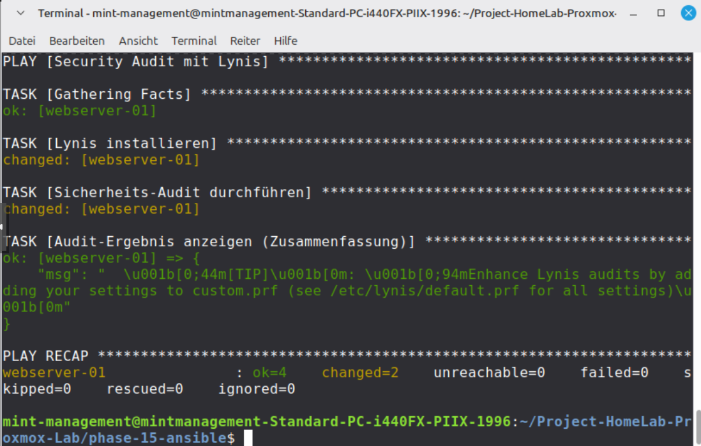
*Abbildung 1: Bestätigung der Lynis-Installation und des Audit-Tasks.*

## 📊 Performance-Metriken & Fortschritt
Der Erfolg der Härtung wird durch den Hardening Index objektiviert. Durch gezielte Maßnahmen konnten wir den Score steigern.

| Metrik | Baseline | Nach Härtung | Status |
| :--- | :--- | :--- | :--- |
| **Hardening Index** | 68 | **70** | 🟢 Erhöht |
| **Docker Security** | 0 Warnings | 0 Warnings | 🟢 Optimal |


## 🛡️ Umgesetzte Härtungs-Maßnahmen (via Ansible)
Basierend auf den detaillierten Lynis-Suggestions () wurden folgende Konfigurationen automatisiert angepasst:

1. **SSH-Integrität**:
   * Anhebung des Log-Levels auf `VERBOSE` für detaillierte Forensik.
   * Deaktivierung von `AllowTcpForwarding`, um unautorisierte Tunnel zu unterbinden.
2. **System-Compliance**:
   * Implementierung eines rechtlichen Warnbanners (`/etc/issue`), um unbefugten Zugriff explizit zu untersagen.
3. **Betriebssicherheit**:
   * Auflösung von Paketmanager-Konflikten und automatisierter Neustart kritischer Dienste nach Security-Patches.

## 🏁 Fazit
Die Infrastruktur erfüllt nun höhere Sicherheitsstandards. Der Anstieg des Hardening Index von 68 auf 70 beweist die Wirksamkeit der "Defense in Depth"-Strategie: Von der pfSense-Firewall über VLAN-Isolation bis hin zur gehärteten Applikations-Ebene.

# 📂 Phase 17: Advanced Hardening, Detection & Incident Response

In dieser Phase wurde die Sicherheit des Webservers von der Peripherie in den Kern des Betriebssystems verlagert. Der Fokus lag auf der Implementierung von Intrusion Detection Systemen (IDS) und der Härtung von Kernel-Parametern.

## 🛠️ Implementierte Sicherheits-Komponenten

### 1. Kernel-Härtung (Network Stack)
Mittels Ansible wurden kritische `sysctl`-Parameter optimiert, um den Server gegen Netzwerk-Angriffe zu immunisieren.
* **IP-Spoofing Schutz**: Aktivierung von `rp_filter`.
* **ICMP-Sicherheit**: Ignorieren von Redirects und Broadcast-Pings zur Vermeidung von Man-in-the-Middle-Angriffen.
* **Hardware-Sicherheit**: Deaktivierung von USB-Storage-Treibern auf Software-Ebene.

### 2. Detection & Vulnerability Management
Um verdächtige Aktivitäten frühzeitig zu erkennen, wurden folgende Tools ausgerollt:
* **AIDE (File Integrity Monitoring)**: Erstellung einer Baseline der Systemdateien zur Erkennung von Manipulationen.
* **Rkhunter (Rootkit Scanner)**: Durchführung von automatisierten Scans auf bekannte Backdoors und verdächtige Dateitypen.
* **Process Accounting (acct)**: Lückenlose Protokollierung von Benutzerbefehlen zur forensischen Analyse.

### 3. Incident Response mit Fail2Ban
Implementierung eines Schwellenwert-basierten Sperrsystems. IPs, die mehrfach an der SSH-Authentifizierung scheitern, werden automatisch auf Firewall-Ebene für 60 Minuten gesperrt.

## 📊 Ergebnisse & Audit-Verifizierung

Durch die Kombination aus Kernel-Härtung und Monitoring-Tools konnte die Resilienz des Systems signifikant gesteigert werden.

| Metrik | Wert | Status |
| :--- | :--- | :--- |
| **Hardening Index (Neu)** | **72** | 🟢 Steigerung gegenüber Baseline |
| **Rootkit Check** | 0 Possible Rootkits | ✅ Bestanden |
| **Kernel Security** | Sysctl Optimized | ✅ Abgeschlossen |


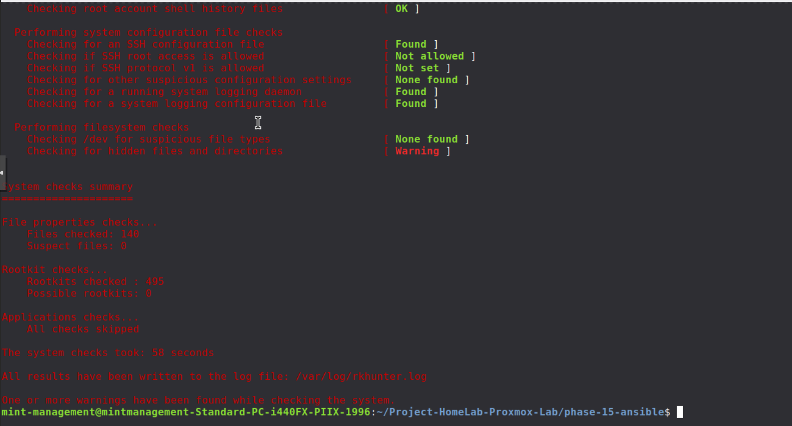
*Zusammenfassung des Rootkit-Scans ohne kritische Funde.*

## 🏁 Fazit
Das System verfügt nun über aktive Abwehrmechanismen. Während Phase 16 die Compliance sicherstellte, hat Phase 17 die technische Tiefe für Detection & Response geschaffen.

# 📂 Phase 18: IPS-Scharfschaltung & Management-Härtung

## 🎯 Zielsetzung
Versetzen von Suricata in den **Blocking-Mode** (IPS) und Absicherung des Admin-Zugangs, um ein versehentliches Aussperren ("Lockout") zu verhindern.

---

## 🖥️ 1. DHCP & IP-Management
Um eine verlässliche Whitelist zu führen, wurde der Management-PC fest an eine Identität gebunden.

* **Host-Identität:** `mint-management`
* **MAC-Adresse:** `bc:24:11:02:83:6d`
* **Feste IP:** `10.0.10.52`
* **Netzwerk-Hygiene:** Der dynamische DHCP-Pool wurde auf `.60` bis `.100` verschoben, um Platz für statische Mappings zu schaffen und IP-Konflikte zu vermeiden.

---

## 🧱 2. Suricata IPS-Konfiguration
Der Status wurde von "nur Beobachten" auf "aktives Blockieren" umgestellt.

* **Modus:** `Legacy Mode` (für maximale Kompatibilität mit der Pass List).
* **Aktion:** `Block Offenders` aktiviert.
* **Sicherheitsnetz:** Zuweisung der `HomeLab_Whitelist` als **IP Pass List**, damit der Management-PC (`10.0.10.52`) niemals blockiert wird.
* **State-Kill:** `Kill States` aktiviert, um bösartige Verbindungen sofort hart zu trennen.

---

## 🧪 3. Validierung (Der "Feuertest")
Die Wirksamkeit der Regeln wurde mit einem simulierten Angriff geprüft.

* **Test-Vektor:** `curl -A "eicar" http://testmyids.com`
* **Erkennung:** Suricata meldete sofort `GPL ATTACK_RESPONSE id check returned root`.
* **Reaktion:** Die Angreifer-IP `217.160.0.187` wurde unmittelbar in die **Block-Liste** verschoben.
* **Erfolg:** Der Management-PC blieb dank der Pass List online und handlungsfähig.
* 
  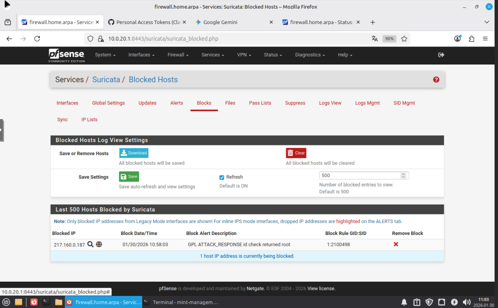
---

## 🧹 4. Log- & System-Hygiene
* **Auto-Cleanup:** Log-Management aktiviert, um das Volllaufen der Festplatte zu verhindern.
* **Dashboard:** Integration der **Suricata Alerts** in das pfSense-Hauptmenü zur Echtzeit-Überwachung.
* **Persistence:** Alle kritischen Zugangsdaten sind sicher in der `vault_passwords.yml` dokumentiert.

---

# 📂 Phase 19: Web-Vulnerability Management & Server-Härtung

## 🎯 Zielsetzung
Identifizierung von Schwachstellen auf dem Webserver (`10.0.20.50`) mittels automatisierter Scans und Durchführung gezielter Härtungsmaßnahmen zur Reduzierung der Angriffsfläche.

---

## 🔍 1. Vulnerability Scanning (Reconnaissance)
Ein technisches Audit mit `nmap --script vuln` deckte kritische Fehlkonfigurationen in der Web-Infrastruktur auf.

* **Zielsystem:** `10.0.20.50` (Debian Webserver)
* **Status:** Kritische Sicherheitsmängel identifiziert.
* **Befund A:** Fehlende `HttpOnly` und `Secure` Flags bei Session-Cookies (PHPSESSID) auf den Ports 80, 443 und 8080.
* **Befund B:** Directory Enumeration ermöglichte das Auffinden der sensiblen Datei `/log.php`.

---

## 🛠️ 2. Remediation (Durchgeführte Härtung)
Um die gefundenen Lücken zu schließen, wurden Konfigurationsänderungen auf Applikations- und Serverebene vorgenommen.

* **Cookie-Sicherheit (PHP):** In der `/etc/php/8.4/apache2/php.ini` wurden `session.cookie_httponly = On` und `session.cookie_secure = On` aktiviert.
* **Zugriffsschutz (Apache):** Implementierung eines `<Files>`-Blocks in der `apache2.conf`, um den direkten Zugriff auf `/log.php` global zu verweigern.
* **SSH-Hygiene:** Validierung der SSH-Konfiguration; der Dienst war bereits korrekt mit `PermitRootLogin no` gegen direkten Root-Zugriff abgesichert.

---

## 🧪 3. Validierung (Der Wirksamkeitsnachweis)
Nach dem Neustart der Dienste wurden die Maßnahmen vom Management-PC aus verifiziert.

* **Cookie-Check:** `curl -I` bestätigt, dass Session-Cookies nun sicher mit `; secure; HttpOnly` übertragen werden.
* **Zugriffs-Check:** Ein Aufruf der Datei `/log.php` resultiert nun unmittelbar in einem **403 Forbidden**.
* **Erfolg:** Die von Nmap gemeldeten Schwachstellen wurden effektiv eliminiert.

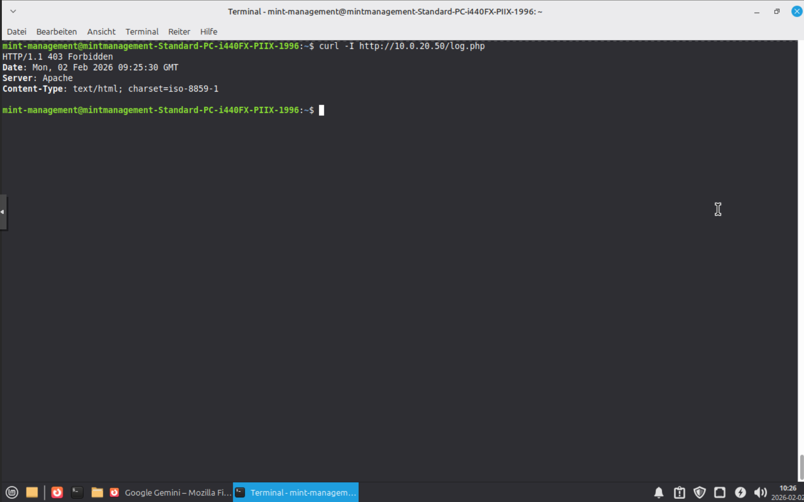

---

## 🧹 4. Dokumentation & Persistence
* **Standardisierung:** Alle Web-Sicherheitseinstellungen wurden in die globalen Konfigurationsdateien des Servers übernommen.
* **Asset-Management:** Die Zugangsdaten für den Webserver und die Pfade zur Verschlüsselung sind sicher in der `vault_passwords.yml` hinter


# 📂 Phase 20: Zentralisiertes Logging & SIEM-Vorbereitung

## 🎯 Zielsetzung
Etablierung eines zentralen Log-Managements auf der pfSense, um Sicherheitsereignisse (wie die in Phase 19 provozierten 403-Fehler) vom Webserver in Echtzeit zu erfassen, zu korrelieren und für automatisierte Sperrmechanismen (IPS) nutzbar zu machen.

---

## 📡 1. Log-Infrastruktur (Empfänger & Sender)
Um eine saubere Trennung vom restlichen Firewall-Traffic zu gewährleisten, wurde ein dedizierter Log-Pfad über einen alternativen Port eingerichtet.

* **Empfänger (pfSense):** Konfiguration des `syslog-ng` Pakets auf Port `5140/UDP`.
* **Sender (Webserver):** Installation und Konfiguration von `syslog-ng` auf `10.0.20.50`, um lokale Apache-Fehler-Logs an die Firewall (`10.0.20.1`) weiterzuleiten.
* **Firewall-Regel:** Freischaltung von Port `5140` auf dem Interface **WEBSERVER**, um den eingehenden Log-Stream zu autorisieren.

---

## 🛠️ 2. Konfiguration (Advanced Mapping)
Da die Standard-Objekte der pfSense geschützt sind, wurde eine manuelle Log-Kette innerhalb von `syslog-ng` implementiert, um Fehlerquellen (wie doppelte Datei-Zugriffe) zu vermeiden.

* **Custom Source:** Erstellung des Objekts `s_webserver_remote`, das explizit auf Netzwerk-Pakete an Port 5140 lauscht.
* **Log Logic:** Verknüpfung der Remote-Quelle mit dem Ziel-Pfad `/var/syslog-ng/default.log` über das Log-Objekt `l_webserver_connect`.
* **Dienst-Validierung:** Sicherstellung des Dienststatus über `Status > Services`, nachdem Syntax-Fehler in der `syslog-ng.conf` behoben wurden.

---

## 🧪 3. Validierung (Live-Monitoring)
Der Erfolg der zentralen Protokollierung wurde durch den Abgleich von Webserver-Events und Firewall-Anzeige nachgewiesen.

* **Event-Trigger:** Manuelle Auslösung der in Phase 19 gehärteten Zugriffsbeschränkung auf `log.php`.
* **Log Viewer:** Erfolgreiche Sichtung der Apache-Fehlermeldungen (`authz_core:error`) direkt in der pfSense-Weboberfläche.
* **Filter-Check:** Verifikation der Sichtbarkeit mittels Hostnamen-Filter (`webserver`), wodurch relevante Angriffsversuche sofort isoliert werden können.

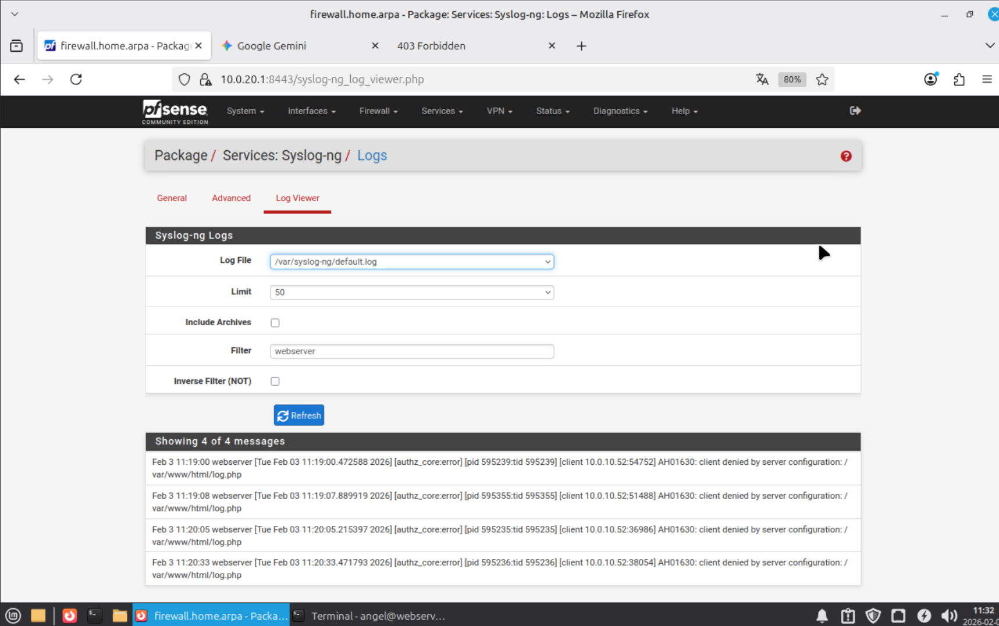

---

## 🧹 4. Dokumentation & Persistence
* **Fehlerbehebung:** Dokumentation der Syntax-Korrekturen (Vermeidung von `conflicting persist-names`) zur zukünftigen Wartung des Log-Dienstes.
* **Vault-Integration:** Hinterlegung der für die API-Anbindung notwendigen Credentials in der Datei `vault_passwords.yml`.
* **Ausblick:** Die nun fließenden Logdaten dienen als Trigger für Phase 21 (Automatisiertes Blocking mittels pfBlockerNG).
